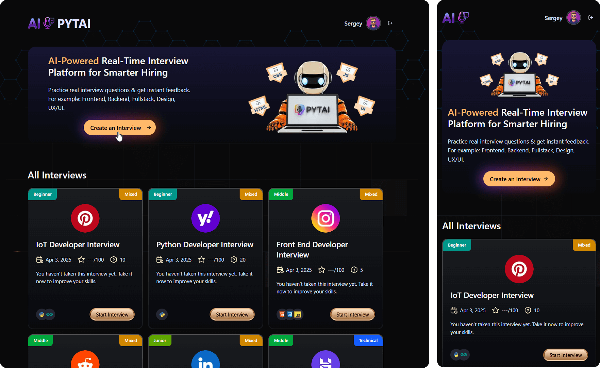
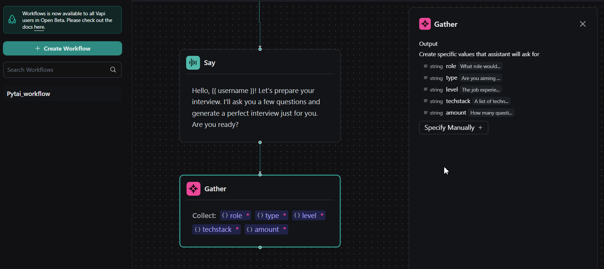

# AI-Powered Real-Time Interview Platform

<div align="center">
  
</div>

## Overview

**Pytai** is an intelligent, voice-driven interview platform that uses conversational AI to evaluate candidates in real time. It delivers automated, consistent, and scalable interviews with dynamic question flows, live voice interaction, and detailed scoring of candidate performance.

[](https://pytai.space/)

By recreating realistic interview environments, Pytai helps:
- **Candidates** practice and refine their interview skills
- **Recruiters** standardize and streamline their evaluation process
- **Companies** make better-informed and data-driven hiring decisions

## ⭐ Key Features

- **AI-Powered Interviews**: Natural, voice-based interviews with adaptive conversational flow
- **Real-Time Feedback**: Immediate assessment of candidate responses
- **Role-Specific Questions**: Tailored interview sets for different roles and seniority levels
- **Technology Stack Specialization**: Interviews adjusted for specific technology stacks
- **Comprehensive Scoring**: Granular feedback across multiple evaluation categories
- **Secure Authentication**: Email verification, secure sessions, and account management
- **Interview History**: View, track, and compare previous interviews and performance trends
- **Responsive Design**: Fully responsive layout that works smoothly across devices

## Technologies Used

- **Frontend**: Next.js, React, TypeScript
- **Styling**: Tailwind CSS
- **Authentication**: [Firebase](https://firebase.google.com/) Authentication
- **Database**: Firebase Firestore
- **AI Integration**: 
  - [Google Gemini AI](https://aistudio.google.com/) for evaluating responses
  - [Vapi](https://vapi.ai/) for real-time voice interaction
  - [AI SDK](https://sdk.vercel.ai/) by Vercel
- **Form Handling**: React Hook Form with Zod-based validation
- **UI Components**: Custom components built on top of Radix UI primitives
- **Notifications**: Sonner toast notifications

## Getting Started

### Prerequisites

- Node.js 18+ and npm
- Firebase project with Firestore and Authentication enabled
- API keys for Google Gemini and Vapi



### Installation

1. Clone the repository:

```bash
git clone https://github.com/getFrontend/app-ai-interviews.git
cd app-ai-interviews
```

2. Install dependencies:

```bash
npm install
```

3. Set up environment variables:  
   Create a `.env.local` file in the project root with the following variables:

```
# Firebase
NEXT_PUBLIC_FIREBASE_API_KEY=your_firebase_api_key
NEXT_PUBLIC_FIREBASE_AUTH_DOMAIN=your_firebase_auth_domain
NEXT_PUBLIC_FIREBASE_PROJECT_ID=your_firebase_project_id
NEXT_PUBLIC_FIREBASE_STORAGE_BUCKET=your_firebase_storage_bucket
NEXT_PUBLIC_FIREBASE_MESSAGING_SENDER_ID=your_firebase_messaging_sender_id
NEXT_PUBLIC_FIREBASE_APP_ID=your_firebase_app_id

# Google AI
GOOGLE_API_KEY=your_google_api_key

# Vapi
VAPI_API_KEY=your_vapi_api_key
```

4. Start the development server:

```bash
npm run dev
```

5. Open [http://localhost:3000](http://localhost:3000) in your browser to view the application.

## Project Structure

```
app-ai-interviews/
├── app/                  # Next.js app directory
│   ├── (auth)/           # Authentication routes
│   ├── (root)/           # Main application routes
│   ├── api/              # API routes
│   └── layout.tsx        # Root layout
├── components/           # React components
│   ├── auth/             # Authentication components
│   ├── ui/               # UI components
│   └── ...               # Other components
├── constants/            # Application constants
├── firebase/             # Firebase configuration
├── lib/                  # Utility functions and server actions
│   ├── actions/          # Server actions
│   └── utils.ts          # Helper functions
├── public/               # Static assets
└── types/                # TypeScript type definitions
```

## AI Voice Integration

Pytai uses a robust AI voice integration pipeline:

1. The `Agent` component initializes the voice interface and orchestrates the conversation
2. Interview questions are dynamically generated based on the selected role, level, and tech stack
3. The AI interprets and processes candidate responses in real time using natural language understanding
4. Speech-to-text transcription converts spoken answers into text for downstream analysis
5. The system scores and evaluates answers using Google's Gemini AI model
6. Rich, end-to-end feedback is generated from the complete interview transcript

## How to Customize or Extend

### Adding New Interview Types

1. Add or modify interview types in `constants/index.ts`
2. Adjust the interview generation prompt in `app/api/vapi/generate/route.ts`
3. Create or update any UI components required for the new interview type

### Customizing Feedback Categories

1. Update the feedback schema in `constants/index.ts`
2. Align the feedback generation prompt in `lib/actions/general.action.ts` with your new schema

### Adding New Tech Stacks

1. Add new tech stack icons to the `public` directory
2. Extend the tech stack mappings in `constants/index.ts`
3. Make sure your AI prompt templates are aware of and describe the new tech stack

## ↘️ Deployment

This application can be deployed to Vercel in a few steps:

1. Push your code to a GitHub repository
2. Import the project into Vercel
3. Configure the required environment variables
4. Deploy

## 🔮 Future Improvements

- Multi-language support for global candidates
- Video interview capabilities
- Integration with ATS (Applicant Tracking Systems)
- Advanced analytics dashboard for recruiters
- Customizable interview templates across industries
- Mobile application for on-the-go interview practice

## ✌️ Contributing

Contributions are welcome! Please feel free to open a Pull Request.

1. Fork the repository
2. Create your feature branch (`git checkout -b feature/amazing-feature`)
3. Commit your changes (`git commit -m 'Add some amazing feature'`)
4. Push to the branch (`git push origin feature/amazing-feature`)
5. Open a Pull Request

## License

[MIT License](LICENSE) - You are free to use and modify this project for your own needs.

------------

Built with ❤️ using [JSMastery](https://www.youtube.com/@javascriptmastery/videos), Next.js 15, Vapi AI and Google Gemini

© 2026 Pytai AI by Kartik. All rights reserved.</p>

